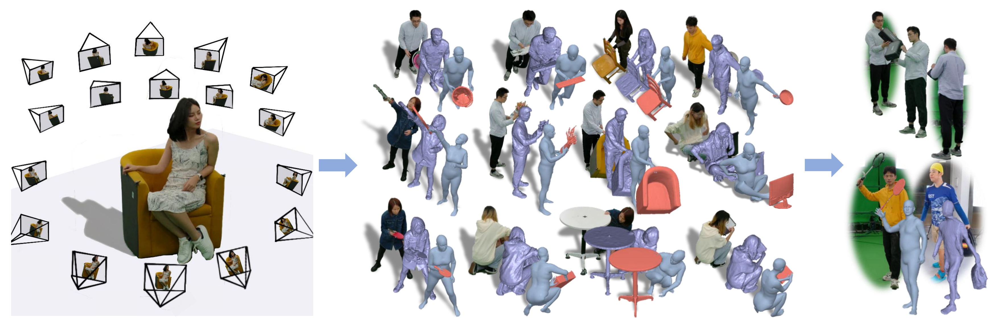
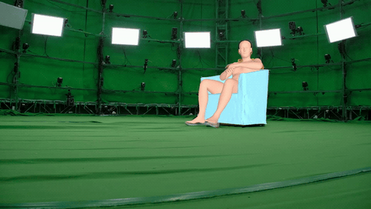
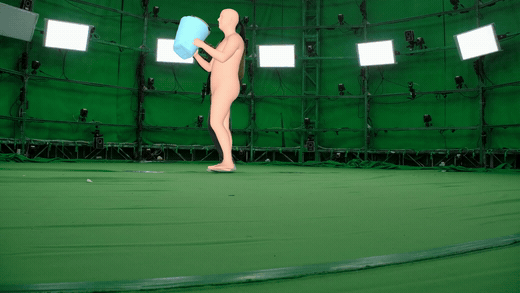
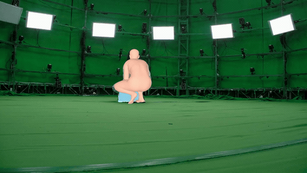

# NeuralDome & HOIM3 Dataset Toolbox


Welcome to the repository for the Dataset Toolbox, which facilitates downloading, processing, and visualizing the Dataset. This toolbox supports our publication:


|                                                                 <h2 align="center"> NeuralDome </h2>                                                                 |                                                                       <h2 align="center"> HOIM3 </h2>                                                                        |
|:--------------------------------------------------------------------------------------------------------------------------------------------------------------------:|:----------------------------------------------------------------------------------------------------------------------------------------------------------------------------:|
|                                      NeuralDome: A Neural Modeling Pipeline on Multi-View Human-Object Interactions (CVPR2023)                                       |                                  HOI-M3: Capture Multiple Humans and Objects Interaction within Contextual Environment (CVPR2024 Highlight)                                  |
|                                  We construct a 76-view dome to acquire a complex human object interaction dataset, named HODome,.                                   |                                    HOI-M3 is a large-scale dataset for modeling the interactions of multiple humans and multiple objects.                                    |
| **[[Paper]](https://arxiv.org/pdf/2212.07626.pdf) [[Video]](https://www.youtube.com/watch?v=Nb82f5dm2GE) [[Project Page]](https://juzezhang.github.io/NeuralDome/)** | **[[Paper]](https://arxiv.org/pdf/2404.00299) [[Video]](https://www.youtube.com/watch?v=Fq6iqoXC99A&t=2s) [[Project Page]](https://juzezhang.github.io/HOIM3_ProjectPage/)** |
|                             **[[Hodome Dataset]](https://drive.google.com/drive/folders/19td-JTT38bduUAw384znXs_9dyS95q5e?usp=sharing)**                             |                                 **[[HOIM3 Dataset]](https://drive.google.com/drive/folders/1bT7J0XnbUx5goixgJRWJxpycOFffpwOc?usp=sharing)**                                  |
|                                                                                                         |                                                                                                                      |


## 🚩Updates
- **May 26, 2026**: [Hodome] Released the **SMPL-X** reconstructions (`smplx/{Seq}.npz`, body + hands, valid from frame 0) and the **MHR model parameters** (`mhr/{Seq}/mhr/*.json`) — the two recommended pose sources. Objects (`object/{Seq}.npz`) and the legacy SMPL-H (`smplh/`) are provided as well.
- **July 1, 2024**: [HOIM3] Due to the large size of the mask, we are currently only uploading the annotated mask for the 3rd view!!
- **June 30, 2024**: Important! All the object's rotations were mistakenly saved as the transpose of a rotation matrix.
- **June 12, 2024**: [HOIM3] Currently uploading the HOIM3 dataset to Google Cloud Drive.
- **Jan. 05, 2024**: [Hodome] Upload of Hodome is now complete!

## 📖 Setup and download

### Installation

A single script provisions the full environment (Linux + CUDA):

```bash
bash setup_env.sh                 # optional args: [ENV_NAME] [MHR_ASSETS_DIR]
conda activate hodome             # default env name
```

It creates a Python 3.12 conda environment with **PyTorch, PyTorch3D and PyMomentum installed
together from conda-forge** (so their compiled-extension ABIs match), adds `smplx`, `mhr` and
`pyrender` via pip, downloads the MHR model assets (~200 MB), and runs an import check. For MHR
rendering, export the `MHR_ASSETS_DIR` printed at the end (or pass `--mhr_assets_dir` to
`scripts/forward_mhr_to_npz.py`). Prefer to install by hand? Expand the box below.

<details>
<summary>What it installs &amp; common pitfalls</summary>

- **conda-forge** (Python 3.12 — pymomentum wheels are 3.12+, mhr needs ≥3.11): `pytorch pytorch3d pymomentum trimesh py-opencv tqdm yacs pyyaml matplotlib scikit-learn hatchling hatch-vcs editables`
- **pip**: `smplx`, `mhr`, `pyrender`; **assets**: `assets.zip` from the MHR v1.0.0 GitHub release.
- Don't install torch from the `pytorch` channel and add pymomentum afterward — it silently upgrades torch and breaks PyTorch3D's `_C` extension (`ImportError: undefined symbol …c105Error…`). Keep them all conda-forge / recreate the env if this happens.
- `pip install pymomentum` would grab an unrelated PyPI package (v0.1.4) — the real one is conda-only, which is why the script uses conda-forge.
- `FBX file not found …/assets/lod1.fbx` → MHR assets not downloaded or `MHR_ASSETS_DIR` unset.
- **Developing on MHR itself?** `pip install --no-build-isolation -e /path/to/MHR` instead of `pip install mhr` (the checkout ships its own `assets/`, no download needed).
- The legacy HOIM3/NeuralDome SMPL-H scripts need `requirements.txt` extras (`chumpy`, old `pytorch-lightning`/`numpy`) — not required for the HoDome SMPL-X/MHR pipeline; install in a separate env if needed.
</details>

### Body models

The SMPL-X / SMPL / MANO body models are **license-restricted and NOT redistributed** here.
Register and download them from the official sites, then place them under `models/model_files/`:

```bash
bash scripts/prepare_body_models.sh   # prints exactly what to download & where, then verifies
```

Only **SMPL-X** is needed for the recommended pipeline — register at
[smpl-x.is.tue.mpg.de](https://smpl-x.is.tue.mpg.de) and place the neutral model at
`models/model_files/smplx/SMPLX_NEUTRAL.npz`. `--source mhr` needs no body model.

> **Use `smplx` (recommended) or `mhr`. The older SMPL-H pose data (`smplh/`) is lower quality**
> and is not recommended — kept only for backward compatibility.

### Data download &amp; layout

<details>
<summary>Download, extract, and dataset structure</summary>

76-view RGB videos + refined masks, three human body-model annotations, object 6DoF, and
scanned-object templates. The release packs each bulky modality **per subject**
(`subjectNN.tar.gz`) and ships the pose annotations as **flat per-sequence `.npz`**.

**One-click download** (from the public [Hodome Drive](https://drive.google.com/drive/folders/19td-JTT38bduUAw384znXs_9dyS95q5e)) — fetches and untars everything:

```bash
pip install -U gdown
python scripts/download_hodome.py --out ./HODome                 # everything
# or a subset:
python scripts/download_hodome.py --out ./HODome --modalities smplx object mhr scaned_object calibration_ground
# images are not shipped (too large) — extract them from the videos:
python ./scripts/video2image.py
```

Prefer to do it by hand? Download from the Drive and extract the per-subject tars in place
(`for d in videos mask_refine mhr scaned_object; do (cd "$d" && for f in *.tar*; do tar -xf "$f"; done); done`).
For very large / flaky transfers, `rclone copy` against the same folder is a robust alternative.

```
HODome/
├─ videos/{Seq}/data1.mp4 … data76.mp4      # 76-view 4K RGB        (videos/subjectNN.tar.gz)
├─ images/{Seq}/{cam}/{frame}.jpg           # extracted via video2image.py (not shipped)
├─ smplx/{Seq}.npz          ★ RECOMMENDED — SMPL-X reconstruction (body+hands, valid from frame 0)
├─ mhr/{Seq}/mhr/*.json     ★ RECOMMENDED — MHR params              (mhr/subjectNN.tar.gz)
├─ smplh/{Seq}.npz            legacy SMPL-H GT — lower accuracy, prefer smplx / mhr
├─ object/{Seq}.npz          object 6DoF (object_R / object_T), ground-aligned
├─ mask_refine/{Seq}/…       720p refined human/object masks        (mask_refine/subjectNN.tar.gz)
├─ scaned_object/{obj}/      scanned object templates (.obj)        (scaned_object/{obj}.tar)
├─ calibration_ground/{date}/   ground-aligned camera calibration
├─ dataset_information.json, startframe.json, LICENSE.md
```

**Human pose sources** — three body models cover the same actor. **Use `smplx` (recommended) or
`mhr`**; both are the 2025–2026 reconstructions (modern SMPL-X / dense MHR, full hands, consistent
identity from frame 0). **`smplh` is the older SMPL-H ground-aligned GT and is noticeably less
accurate** — kept only for backward compatibility. Object pose is always `object/{Seq}.npz`.
</details>


## 👀 Visualization Toolkit

### SMPL-X / MHR + object — pyrender (recommended)

`scripts/hodome_visualize_pyrender.py` renders the reconstructed **SMPL-X** (or **MHR**) human
together with the interacting **object**, solid-shaded via pyrender:

<p align="center">
  
  
  
</p>

<p align="center"><i>SMPL-X human (skin) + object (cyan) overlaid on the dome video — subject05_smallsofa, subject08_trashcan, subject07_box.</i></p>

```bash
# human = --source smplx (default) or mhr ; object rendered from object/{seq}.npz
PYOPENGL_PLATFORM=egl python scripts/hodome_visualize_pyrender.py \
    --seq_name subject08_trashcan --source smplx --views 0 \
    --output out.mp4 --smplx_npz_dir /path/to/hodome/smplx
```

**Calibration matters** — the SMPL-X/MHR human and the `object/{seq}.npz` object are both in the
**ground-aligned** frame, so use `--calib ground` (default = `calibration_ground/`). Raw
`calibration/` is only for the per-frame `mocap/` SMPL-H source; mixing frames floats the mesh
off the actor. For `--source mhr`, pre-compute vertices once with `scripts/forward_mhr_to_npz.py`.
Runs in the `hodome` env (`setup_env.sh` installs pyrender).

<details>
<summary> Using Pytorch3D: </summary>

Our `hodome_visualization.py` script showcases how to access the diverse annotations in our dataset. It uses the following command-line arguments:

- `--root_path`: Directory containing the dataset.
- `--seq_name`: Sequence name to process.
- `--resolution`: Output image resolution.
- `--output_path`: Where to save rendered images.

Ensure your environment and data are properly set up before executing the script. Here's an example command:

```bash
## Hodome
python ./scripts/hodome_visualization.py --root_path "/path/to/your/data" --seq_name "subject01_baseball" --resolution 720 --output_path "/path/to/your/output"
## HOI-M3
python ./scripts/hoim3_visualization.py --root_path "/path/to/your/data" --seq_name "subject01_baseball" --resolution 720 --output_path "/path/to/your/output --vis_view 0"
```
</details>

<details>
<summary> Using Blender:</summary>


Please refer to [render.md](docs/render.md)

</details>

## 📊 Monocular HOI Benchmark

We benchmark a representative set of **monocular human–object interaction** methods (PHOSA, CHORE,
CONTHO, StackFLOW, HDM, Open4DHOI, VisTracker, CARI4D, InterTrack, …) on HODome's single-view
**view-26** test set (subjects 01–02), each run with its **own released code** and scored by **one
uniform judge protocol** (world→camera transform + BEHAVE-style surface-sampled Chamfer).

- **Writeup (protocol, results table, fairness audit, reproducibility findings):**
  [`docs/benchmark_monocular_hoi.md`](docs/benchmark_monocular_hoi.md)
- **Metric-computation code:** [`benchmark/`](benchmark/) — the exact MPJPE / PA-MPJPE / Chamfer /
  BEHAVE Human-/Object-CD implementation (CONTHO/CHORE Chamfer used verbatim).

## 📖Citation

If you find our toolbox or dataset useful for your research, please consider citing our paper:

```bibtex
@inproceedings{
      zhang2023neuraldome,
      title={NeuralDome: A Neural Modeling Pipeline on Multi-View Human-Object Interactions},
      author={Juze Zhang and Haimin Luo and Hongdi Yang and Xinru Xu and Qianyang Wu and Ye Shi and Jingyi Yu and Lan Xu and Jingya Wang},
      booktitle={CVPR},
      year={2023},
}
@inproceedings{
      zhang2024hoi,
      title={HOI-M3: Capture Multiple Humans and Objects Interaction within Contextual Environment},
      author={Zhang, Juze and Zhang, Jingyan and Song, Zining and Shi, Zhanhe and Zhao, Chengfeng and Shi, Ye and Yu, Jingyi and Xu, Lan and Wang, Jingya},
      booktitle={CVPR},
      year={2024}
}
```
