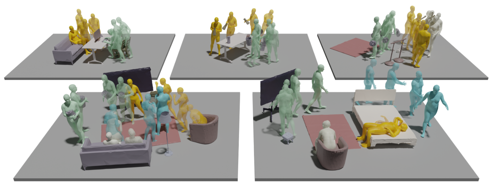

# NeuralDome & HOIM3 Dataset Toolbox


Welcome to the repository for the Dataset Toolbox, which facilitates downloading, processing, and visualizing the Dataset. This toolbox supports our publication:


|                                                                 <h2 align="center"> NeuralDome </h2>                                                                 |                                                                       <h2 align="center"> HOIM3 </h2>                                                                        |
|:--------------------------------------------------------------------------------------------------------------------------------------------------------------------:|:----------------------------------------------------------------------------------------------------------------------------------------------------------------------------:|
|                                      NeuralDome: A Neural Modeling Pipeline on Multi-View Human-Object Interactions (CVPR2023)                                       |                                  HOI-M3: Capture Multiple Humans and Objects Interaction within Contextual Environment (CVPR2024 Highlight)                                  |
|                                  We construct a 76-view dome to acquire a complex human object interaction dataset, named HODome,.                                   |                                    HOI-M3 is a large-scale dataset for modeling the interactions of multiple humans and multiple objects.                                    |
| **[[Paper]](https://arxiv.org/pdf/2212.07626.pdf) [[Video]](https://www.youtube.com/watch?v=Nb82f5dm2GE) [[Project Page]](https://juzezhang.github.io/NeuralDome/)** | **[[Paper]](https://arxiv.org/pdf/2404.00299) [[Video]](https://www.youtube.com/watch?v=Fq6iqoXC99A&t=2s) [[Project Page]](https://juzezhang.github.io/HOIM3_ProjectPage/)** |
|                             **[[Hodome Dataset]](https://drive.google.com/drive/folders/1-QHvcwa71Wk7rdfnQrOyInqK-SWK6lRA?usp=sharing)**                             |                                 **[[HOIM3 Dataset]](https://drive.google.com/drive/folders/1bT7J0XnbUx5goixgJRWJxpycOFffpwOc?usp=sharing)**                                  |
|                                                                                                         |                                                                                                                      |


## 🚩Updates
- **June 30, 2024**: Important! All the object's rotations were mistakenly saved as the transpose of a rotation matrix.
- **June 12, 2024**: Currently uploading the HOIM3 dataset to Google Cloud Drive.
- **Jan. 05, 2024**: Currently uploading the entire dataset to Google Cloud Drive. Due to its size exceeding 5TB, this may take several weeks.
- **Jan. 30, 2024**: Upload of raw video data is now complete!
- **Feb. 9, 2024**: Upload of masks is now complete!

## 📖Setting Up Your Environment

To get started, set up your environment as follows:

```bash
# Create a conda virtual environment
conda create -n NeuralDome python=3.8 pytorch=1.11 cudatoolkit=11.3 torchvision -c pytorch -y
conda activate NeuralDome

## Install PyTorch3D
conda install -c fvcore -c iopath -c conda-forge fvcore iopath
pip install "git+https://github.com/facebookresearch/pytorch3d.git@stable"

# Install other requirements
pip install -r requirements.txt
```

## 🏃 Preparing the Data

The complete dataset features 76-view RGB videos along with corresponding masks, mocap data, geometry, and scanned object templates. Download and extract the dataset from [this link](https://drive.google.com/drive/folders/1-QHvcwa71Wk7rdfnQrOyInqK-SWK6lRA):

```bash
for file in *.tar; do tar -xf "$file"; done
```

## Data Structure Overview

The dataset is organized as follows:
```
├─ HODome
    ├─ images
        ├─ Seq_Name
            ├─ 0
                ├─ 000000.jpg
                ├─ 000001.jpg
                ├─ 000003.jpg
                    ...
            ...
    ├─ videos
        ├─ Seq_Name
            ├─ data1.mp4
            ├─ data2.mp4
            ...
            ├─ data76.mp4
    ├─ mocap
        ├─ Seq_Name
            ├─ keypoints2d
            ├─ keypoints3d
            ├─ object
            ├─ smpl
    ├─ mask
        ├─ Seq_Name
            ├─ homask
            ├─ hmask
            ├─ omask
    ├─ calibration
        ├─ 20221018
        ...
    ├─ dataset_information.json
    ├─ startframe.json
    ...
```


## Extracting Images from Videos

Since the image files are extremely large, we have not uploaded them. Please run the following scripts to extract the image files from the provided videos.

```bash
python ./scripts/video2image.py
```

## 👀 Visualization Toolkit

### Using Pytorch3D:

Our `hodome_visualization.py` script showcases how to access the diverse annotations in our dataset. It uses the following command-line arguments:

- `--root_path`: Directory containing the dataset.
- `--seq_name`: Sequence name to process.
- `--resolution`: Output image resolution.
- `--output_path`: Where to save rendered images.

Ensure your environment and data are properly set up before executing the script. Here's an example command:

```bash
python ./scripts/hodome_visualization.py --root_path "/path/to/your/data" --seq_name "subject01_baseball" --resolution 720 --output_path "/path/to/your/output"
```

### Using Blender:

Please refer to [render.md](docs/render.md)


## 📖Citing Our Work

If you find our toolbox or dataset useful for your research, please consider citing our paper:

```bibtex
@inproceedings{
      zhang2023neuraldome,
      title={NeuralDome: A Neural Modeling Pipeline on Multi-View Human-Object Interactions},
      author={Juze Zhang and Haimin Luo and Hongdi Yang and Xinru Xu and Qianyang Wu and Ye Shi and Jingyi Yu and Lan Xu and Jingya Wang},
      booktitle={CVPR},
      year={2023},
}
@inproceedings{
      zhang2024hoi,
      title={HOI-M3: Capture Multiple Humans and Objects Interaction within Contextual Environment},
      author={Zhang, Juze and Zhang, Jingyan and Song, Zining and Shi, Zhanhe and Zhao, Chengfeng and Shi, Ye and Yu, Jingyi and Xu, Lan and Wang, Jingya},
      booktitle={CVPR},
      year={2024}
}
```
